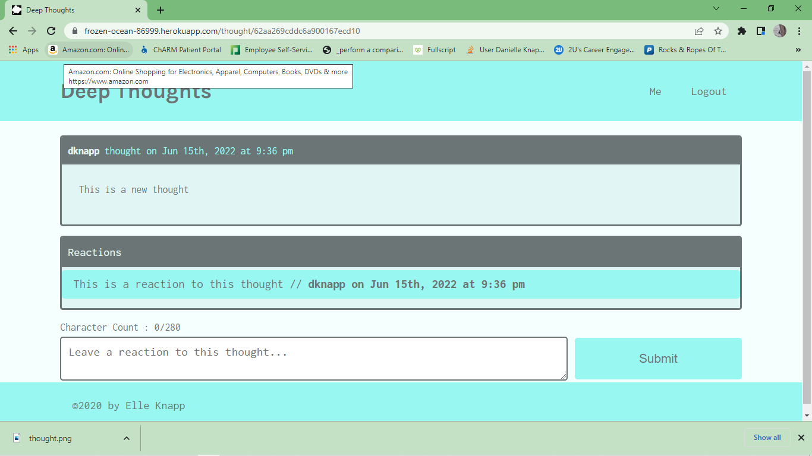

# deep-thoughts

 

# Description
Deep Thoughts is an applciation that allows users to post thoughts and make friends. Users can signup to create an account that allows them to post deep thoughts, reply to others, and add friends. 

 
 

## Table of Contents
  * [Technologies](#technologies)
  * [Usage](#usage)
  * [Link](#link)
  * [Credits](#credits)

## Technologies used
- Node.js
- Express.js
- MongoDB
- Mongoose
- GraphQL
- Apollo
- JWT
- React
- React Router
- Bootstrap

## Usage
Follow the steps below to navigate and use the deep thoughts application:
1. Visit the application by following the link provided below in the Link section.
2. Once you visit the link, you will be presented with the homepage of the application, which contains posts of thoughts by uses
3. Clicking on thoughts will bring up the single thought and reactions to that thought. 
4. Clicking on usernames will bring up the user's profile page
5. To post thoughts or reactions, a user must signup or login
6. Once signed up/logged in a user can post a thought on the home page of their profile page as well as post reactions to single thoughts
7. Users can also add friends to their profile pages by clicking on the add friend button each user has on thier profile page. 

## Link
Click on the link below to visit the Rocks and Ropes Application:  
[Go to app](https://frozen-ocean-86999.herokuapp.com/)

## Credits
[Elle Knapp](https://github.com/dmknapp2385)  
and the University of Arizona Bootcamp